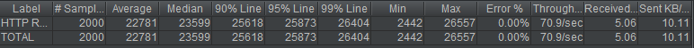
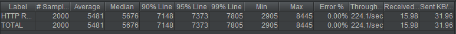
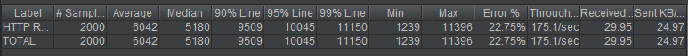

## 秒杀系统演示

分别使用以下三种方式设计秒杀系统：

### Tradition

使用传统方式，先去数据库查询库存，如果库存不为零，则根据用户id和商品id生成订单，否则返回

### 消息队列

使用RocketMQ消息队列，先将请求放入消息队列中然后直接返回，后台消费者异步处理消息，同样查询库存，如果不为零，则根据消息中的用户id和商品id生成订单

### 缓存

使用Redis缓存，在缓存中设置商品库存，然后请求到来的时候先查询库存，如果库存不为零，将请求信息放入缓存队列中，再提交后台任务异步查询缓存队列生成订单，库存为零则返回

## 压测

使用JMeter分别生成2000个请求，下面是请求结果

### Tradition

### 消息队列

### 缓存

## 改进

* 前端可以禁止用户多次点击秒杀按钮

* 数据库可以添加索引来加快性能

* 消息队列的处理要考虑到重复消息的消费处理

* 为了接近实际使用，后端可以在用户请求到来时，查询库存，如果库存足够的话则秒杀成功，返回成功信息并指引用户付款，然后生成订单。库存不足则直接返回秒杀失败信息。